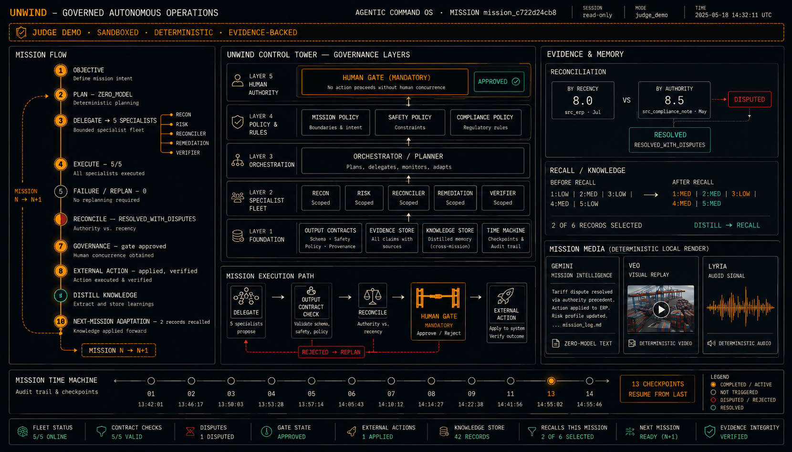

# NYAYA-SATYA

> **"Don't trust the draft. Attack it. Repair it. Attack the repair."**

NYAYA-SATYA is an auditable adversarial evidence and case-reasoning system designed to stress-test fragmented case evidence, expose contradictions and fragile reasoning, explore counterfactual dependencies, propose evidence-grounded repairs, independently re-attack those repairs, and produce a provenance-linked review dossier while keeping consequential legal decisions under human governance.

<p align="center">
  
</p>

> *Synthetic demonstration interface — not real evidence and not a legal verdict.*

---

## 🚀 Demo & Links

- **GitHub Repository**: [https://github.com/akashbichukale111/NYAYA-SATYA](https://github.com/akashbichukale111/NYAYA-SATYA)
- **Live Demo**: `Deployment URL: Pending final public deployment`
- **API Health**: `http://127.0.0.1:8080/health` *(Local / Staging: Pending public DNS mapping)*
- **API Documentation**: `http://127.0.0.1:8080/docs` *(Local / Staging: Pending public DNS mapping)*
- **Demo Script**: [2–3 Minute Hackathon Demo Guide](docs/demo/final-demo-script.md)

---

## 1. The Problem

Legal case information frequently becomes fragmented across diverse sources:

- Voluminous exhibits and evidentiary records
- Witness statements and depositions
- Physical and digital evidentiary items
- Chronological timelines and milestones
- Legal claims and counter-claims
- Hidden or unstated assumptions
- Statutory and procedural propositions
- Pre-trial and procedural event logs

Traditional document-centric workflows and generative assistants tend to draft agreeable text that masks underlying evidentiary flaws. Under pressure, these tools make it difficult to detect:

- **Temporal and factual contradictions** between separate exhibits
- **Unsupported claims** lacking empirical grounding in the record
- **Fragile dependencies** where an entire legal argument rests on a single vulnerable assumption
- **Evidence gaps** where required statutory elements lack corroborating exhibits
- **Downstream blast-radius effects** of conceding, disputing, or modifying a single fact
- **Secondary weaknesses** introduced when a proposed repair inadvertently creates new vulnerabilities

---

## 2. The Solution

NYAYA-SATYA replaces passive drafting with an active, adversarial verification pipeline:

```
Evidence
   ↓
Secure Ingestion (MIME validation, size limits, quarantine, prompt-injection defense)
   ↓
Evidence Registry (SHA-256 content hashing)
   ↓
Provenance Tracking
   ↓
Case Digital Twin (Entities, Claims, Timelines, Relationships, Confidence)
   ↓
TARKA-VYUH Reasoning Engine
   ↓
Adversarial Attack (Gauntlet, Jenga fragility, Missing evidence analysis)
   ↓
Contradiction Analysis
   ↓
Causal / Counterfactual Analysis (Blast-radius, Twin comparison, Interventions)
   ↓
Auto-Healer / Repair Proposal (Utility vector optimization, Evidence grounding)
   ↓
Independent Re-Attack (Zero-memory isolated adversarial validation)
   ↓
UNWIND Governance (Finite State Machine, Proposal immutability, Audit logging)
   ↓
Human Legal Gate (Sole authority for approval; automated bots blocked)
   ↓
Dossier 2.0 (Deterministic fingerprinting, History, Review checklists)
   ↓
Proven Impact (Honest telemetry, Zero fake metrics)
```

---

## 3. What Makes It Different

1. **Adversarial Reasoning**: Actively attacks drafts and claims rather than generating compliant text.
2. **Case Digital Twin**: Constructs a structured, bipartite knowledge graph linking entities, claims, events, and citations.
3. **Cryptographic Provenance Chain**: Every extracted fact is anchored to exact source text spans and SHA-256 exhibit hashes.
4. **Causal Blast-Radius Analysis**: Traces the topological consequences across all claims when a specific fact is perturbed.
5. **Counterfactual Lab**: Executes controlled interventions to test what changes and what remains stable under hypothetical conditions.
6. **Evidence-Grounded Repair**: Generates repair candidates strictly bounded by existing verified record evidence.
7. **Independent Re-Attack**: Automatically submits repair proposals to a separate, memory-isolated adversarial engine to verify robustness.
8. **Repair Immunity**: Quantifies whether a repair genuinely withstands adversarial pressure or merely shifts vulnerability.
9. **Legal Perturbation Testing**: Evaluates threshold shifts in materiality and procedural timelines.
10. **Human-Governed Execution**: Consequential actions are halted at the Human Legal Gate; autonomous AI approval is prohibited.
11. **Cryptographically Linked Dossier History**: Emits versioned, immutable judicial dossiers with parent-child content hashing.
12. **Proven Impact Infrastructure**: Built-in telemetry tracking with privacy-by-design and rigorous epistemic classification.

---

## 4. Architecture

```
                      +-----------------------------+
                      |         USER / CLIENT       |
                      +-----------------------------+
                                     |
                                     v
                      +-----------------------------+
                      |       SECURE REST API       |
                      |  (Bearer Auth, RBAC, CORS)  |
                      +-----------------------------+
                                     |
                                     v
                      +-----------------------------+
                      |       EVIDENCE LAYER        |
                      | (Ingest, Quarantine, Hash)  |
                      +-----------------------------+
                                     |
                                     v
                      +-----------------------------+
                      |      CASE DIGITAL TWIN      |
                      | (Entities, Claims, Graph)   |
                      +-----------------------------+
                                     |
                                     v
                      +-----------------------------+
                      |      TARKA-VYUH ENGINE      |
                      |  * Contradiction Engine     |
                      |  * Adversarial Gauntlet     |
                      |  * Causal Blast-Radius      |
                      |  * Counterfactual Lab       |
                      |  * Auto-Healer (Repair)     |
                      |  * Independent Re-Attack    |
                      +-----------------------------+
                                     |
                                     v
                      +-----------------------------+
                      |      UNWIND CORE GOVERNANCE |
                      | (State Machine, Execution   |
                      |  Guard, Immutable Proposals)|
                      +-----------------------------+
                                     |
                                     v
                      +-----------------------------+
                      |       HUMAN LEGAL GATE      |
                      |  (Sole Decision Authority)  |
                      +-----------------------------+
                                     |
                                     v
                      +-----------------------------+
                      |         DOSSIER 2.0         |
                      | (Audit Trail, Checklists)   |
                      +-----------------------------+
                                     |
                                     v
                      +-----------------------------+
                      |        PROVEN IMPACT        |
                      |  (Epistemic Classification) |
                      +-----------------------------+
```

### Architectural Roles:
- **TARKA-VYUH**: The adversarial reasoning engine responsible for analysis, attacks, causal tracing, and repair synthesis.
- **UNWIND Core**: The governance, authorization, and audit state-machine governing proposal lifecycle.
- **Human Legal Gate**: The non-delegable human decision point retaining exclusive authority over all consequential actions.
- **NYAYA-SATYA**: The unified production system integrating evidence ingestion, reasoning, governance, and audit trails.

---

## 5. Core Components

| Component | Directory | Purpose | Primary Input | Primary Output | Safety Constraint |
| :--- | :--- | :--- | :--- | :--- | :--- |
| **Evidence Ingestion** | [`nyaya_evidence`](nyaya_evidence/) | Ingests and registers case records | Raw PDF, text, or image files | `SafeEvidenceRef`, SHA-256 hashes | 20 MB ceiling, path traversal defense, file quarantine |
| **Case Digital Twin** | [`nyaya_twin`](nyaya_twin/) | Builds case ontology and dependency graph | Registered evidence records | `CaseDigitalTwin` (Entities, Claims, Events) | Cycle detection, confidence bounds, no fabricated citations |
| **Adversarial Engine** | [`nyaya_adversarial`](nyaya_adversarial/) | Stresses claims and detects vulnerabilities | `CaseDigitalTwin` | Conflict reports, Fragility ratings | Sandboxed execution, zero permanent twin mutation |
| **Causal Engine** | [`nyaya_causal`](nyaya_causal/) | Models dependencies and counterfactuals | Case twin, causal node specifications | Blast-radius graphs, Twin comparisons | Directed Acyclic Graph (DAG) validation, intervention isolation |
| **Auto-Healer / Repair** | [`nyaya_repair`](nyaya_repair/) | Synthesizes grounded repair proposals | Attack findings, fragile claims | `RepairCandidate`, Utility vectors | Bounded by record evidence; cannot fabricate facts |
| **Independent Re-Attack** | [`nyaya_reattack`](nyaya_reattack/) | Evaluates repair candidate resilience | `RepairCandidate`, Case twin | Immunity scores, Defended status | Memory-isolated evaluator instance |
| **Dossier 2.0** | [`nyaya_dossier`](nyaya_dossier/) | Formats structured judicial dossiers | Case twin, attack logs, repair records | Versioned `DossierReport` | Cryptographic content hashing, review checklists |
| **UNWIND Core** | [`unwind_core`](unwind_core/) | Enforces lifecycle states and transitions | `ReasoningProposal`, Operator actions | Transition receipts, audit entries | Terminal state locking, bypass prevention |
| **Security & API Layer** | [`services/api`](services/api/) | REST API entry point and authorization | HTTP requests, Bearer tokens | JSON responses, streaming events | Dev-principal lockout in PROD, multi-tenant case isolation |
| **Observability** | [`nyaya_observability`](nyaya_observability/) | Operational monitoring and security audits | Internal execution telemetry | Metrics, Tracing headers, Audit logs | Secret redaction, one-way SHA-256 case ID hashing |
| **Proven Impact** | [`nyaya_impact`](nyaya_impact/) | Measures system utility and efficacy | Validated impact events | `ImpactMetric`, Telemetry reports | Privacy-by-design, Indian/Intl PII rejection |

---

## 6. End-to-End Example (SYNTHETIC EXAMPLE)

> **LABEL: SYNTHETIC DEMONSTRATION CASE — FOR SYSTEM VERIFICATION ONLY**

### Scenario:
A commercial dispute involves a liquidated damages claim for delivery delay.

1. **Evidence E17**: Shipping manifest states: *"Consignment dispatched from warehouse on 12 March 2026."*
2. **Evidence E22**: Carrier transfer docket states: *"Consignment accepted at freight terminal on 14 March 2026."*
3. **Contract Clause 4.2**: Requires formal delivery within 48 hours of dispatch.

### System Execution:
1. **Contradiction Detection**: TARKA-VYUH flags a temporal discrepancy of 48 hours between E17 and E22 regarding the operative dispatch date.
2. **Affected Claims**: Identifies Claim `CLM-17` (dispatch date) and downstream Claim `CLM-30` (statutory breach).
3. **Causal Blast-Radius**: Counterfactual intervention shifting dispatch to 14 March invalidates the liquidated damages claim while preserving underlying contract formation.
4. **Evidence Gap**: Identifies absence of intermediate warehousing logs between 12 March and 14 March.
5. **Repair Proposal**: Auto-Healer proposes adjusting the claim basis to post-acceptance demurrage supported by docket E22.
6. **Independent Re-Attack**: A zero-memory re-attack instance tests the repair against notice provisions in Clause 4.3; the repair survives with a 0.92 immunity rating.
7. **Human Legal Gate**: The proposal transitions to `ASK_HUMAN`. Reviewer `human::senior_counsel` evaluates grounding and authorizes approval.
8. **Dossier Generation**: Emits an auditable Dossier 2.0 entry cryptographically anchored to E17 and E22 checksums.

---

## 7. Security Hardening

NYAYA-SATYA incorporates defense-in-depth security controls verified in Phase 8:

- **Authentication**: Strict Bearer token validation on all mutating endpoints; dev-fallback credentials are automatically rejected in production environments.
- **Role-Based Access Control (RBAC)**: Five distinct roles (`VIEWER`, `ANALYST`, `LEGAL_REVIEWER`, `GOVERNANCE_REVIEWER`, `ADMIN`) enforcing the principle of least privilege.
- **Multi-Tenant Case Isolation**: Cryptographic tenant boundaries guarantee that credentials authorized for one case cannot access, upload to, or query another case.
- **Upload Protection**: File uploads enforce MIME type whitelisting, directory traversal scrubbing, and a 20 MB maximum file size limit.
- **File Quarantine**: Executable files and untrusted file formats are rejected and quarantined.
- **Prompt Injection Defense**: Adversarial sanitizer identifies and neutralizes indirect prompt injections embedded in evidentiary documents.
- **Proposal Immutability**: All proposals carry SHA-256 checksums; modifications after human gate approval trigger immediate execution blocking.
- **Human Gate Integrity**: Automated agent tokens and service credentials are strictly barred from approving governance transitions.
- **Rate Limiting**: Sliding-window rate limiters enforce 60 req/min for general endpoints and 15 req/min for expensive reasoning workloads.
- **Transport & Headers**: Emits `X-Content-Type-Options: nosniff`, `X-Frame-Options: DENY`, `Content-Security-Policy`, and request tracing headers.
- **Audit Logging**: Structured JSON audit events sanitize sensitive parameters and hash case IDs using one-way cryptographic functions.
- **Error Sanitization**: Production error responses suppress internal tracebacks, memory addresses, and file paths.

---

## 8. Governance & Non-Adjudication

NYAYA-SATYA is strictly an evidentiary and legal reasoning assistance tool.

### Explicit Operational Boundaries:
- The system **DOES NOT** decide legal verdicts.
- The system **DOES NOT** determine guilt or innocence.
- The system **DOES NOT** predict judicial win probabilities or case outcomes.
- The system **DOES NOT** replace judges, lawyers, or qualified legal counsel.
- The system **DOES NOT** autonomously execute consequential legal filings or procedural actions.

All substantive reasoning proposals generated by TARKA-VYUH are non-binding recommendations. Consequential actions must be routed through the UNWIND Core state machine and approved by a verified human practitioner via the **Human Legal Gate**.

---

## 9. Verification & Test Suite

The repository maintains an extensive test suite verifying epistemic safety, adversarial mechanics, and security hardening:

- **Phase 8 Security Suite**: `27 passed, 0 failed`
- **Full Repository Regression**: `1,485 passed, 159 skipped, 0 failed` *(208s execution time)*

### Verified Test Categories:
- Mutating endpoint authentication & token verification
- Granular RBAC permission boundaries
- Cross-case tenant isolation barriers
- Executable file rejection & path traversal prevention
- 20 MB upload ceiling enforcement
- Prompt injection detection & sanitization
- Audit log secret redaction & case ID hashing
- Indian and international PII rejection
- Standard and expensive rate limiters
- Security headers & CORS validation
- Sanitized error handling (zero traceback leakage)
- Proposal cryptographic immutability
- Automated actor rejection at Human Legal Gate
- UNWIND governance transition protections
- Container specification & non-root user validation
- Epistemic status & real deployment honesty

---

## 10. Proven Impact & Epistemic Honesty

NYAYA-SATYA enforces strict epistemic taxonomy across all reporting metrics:

- `SYNTHETIC`: Benchmark scenarios generated for regression testing.
- `OBSERVED`: Measurements gathered during controlled, sandbox simulations.
- `PRIVATE_EVALUATION`: Offline tests conducted on non-public synthetic datasets.
- `REAL_DEPLOYMENT`: Live operational telemetry from verified production users.
- `ESTIMATED`: Statistical approximations clearly marked as non-empirical.

### Current Deployment Status:
```json
{
  "status": "NO_REAL_DEPLOYMENT_DATA_YET",
  "real_users": 0,
  "real_cases_processed": 0,
  "hours_saved": 0.0,
  "epistemic_classification": "HONEST_BASELINE"
}
```

The system strictly refrains from fabricating user counts, efficiency claims, or courtroom success rates in the absence of verified production usage.

---

## 11. Project Status

| Phase | Milestone | Status |
| :--- | :--- | :--- |
| **Phase 1** | Evidence Ingestion & Normalization Foundation | **COMPLETE** |
| **Phase 2** | Case Digital Twin & Entity Graph | **COMPLETE** |
| **Phase 3** | TARKA-VYUH Adversarial Reasoning Engine | **COMPLETE** |
| **Phase 4** | Causal Graph & Counterfactual Lab | **COMPLETE** |
| **Phase 5** | Auto-Healer & Independent Re-Attack | **COMPLETE** |
| **Phase 6** | UNWIND Core Governance & Human Legal Gate | **COMPLETE** |
| **Phase 7** | Dossier 2.0 & Proven Impact Infrastructure | **COMPLETE** |
| **Phase 8** | Security Hardening & Container Deployment | **COMPLETE** |
| **Phase 9** | Final Demo, Evaluation & Project Showcase | **COMPLETE** |

---

## 12. Quick Start

### Prerequisites
- Python 3.12 or 3.13
- Git

### 1. Clone the Repository
```bash
git clone https://github.com/akashbichukale111/NYAYA-SATYA.git
cd NYAYA-SATYA
```

### 2. Configure Virtual Environment
```bash
python -m venv .venv
# On Windows:
.venv\Scripts\activate
# On Linux/macOS:
source .venv/bin/activate
```

### 3. Install Dependencies
```bash
pip install -e .
pip install pytest httpx
```

### 4. Environment Configuration
Create a `.env` file (or export environment variables):
```ini
ENVIRONMENT=DEV
UNWIND_OPERATOR_TOKENS=dev-operator-token:ADMIN
RATE_LIMIT_WINDOW_SECONDS=60.0
LOG_LEVEL=INFO
```

### 5. Launch the API Server
```bash
uvicorn services.api.main:app --host 127.0.0.1 --port 8080 --reload
```

### 6. Verify System Health
```bash
curl http://127.0.0.1:8080/health
curl http://127.0.0.1:8080/ready
curl http://127.0.0.1:8080/version
```

### 7. Run Test Suite
```bash
# Run Phase 8 security suite
pytest tests/test_nyaya_satya_phase8.py -v

# Run full regression suite
pytest tests/ -q
```

---

## 13. System Health & Probes

| Endpoint | Method | Purpose | Response |
| :--- | :--- | :--- | :--- |
| `/health` | `GET` | Container liveness check | `{"status": "HEALTHY", "uptime_seconds": ...}` |
| `/ready` | `GET` | Core subsystem readiness | `{"ready": true, "subsystems": {"state_machine": "OK", ...}}` |
| `/version` | `GET` | Version and governance notice | `{"version": "8.0.0", "epistemic_authority": "HUMAN_LEGAL_GATE"}` |

---

## 14. Repository Structure

```
NYAYA-SATYA/
├── docker/                 # Container specifications (non-root Dockerfile)
├── docs/                   # Architectural specifications, threat models, runs
│   ├── assets/             # UI screenshots and visual assets
│   ├── demo/               # 2-3 minute hackathon demonstration script
│   ├── deployment/         # Production deployment and operations runbook
│   └── security/           # Subsystem security audit, threat model, controls
├── nyaya_adversarial/      # Adversarial Gauntlet, Jenga fragility, Missing evidence
├── nyaya_causal/           # Causal graph, Twin comparison, Blast-radius analysis
├── nyaya_dossier/          # Dossier 2.0, Diff engine, Cryptographic fingerprinting
├── nyaya_evidence/         # Ingestion pipeline, Quarantine, File sanitization
├── nyaya_impact/           # Telemetry safety, Metric contracts, Real deployment tracker
├── nyaya_observability/    # In-memory metrics, Request tracing, Audit logger
├── nyaya_perturbation/     # Legal perturbation and threshold sensitivity testing
├── nyaya_readiness/        # Trial readiness evaluation and scoring
├── nyaya_reattack/         # Independent re-attack engine and repair immunity
├── nyaya_repair/           # Auto-Healer, Repair candidates, Utility vectors
├── nyaya_twin/             # Case Digital Twin, Entity graph, Claim extraction
├── services/               # REST API service, Security middleware, Route handlers
├── tarka_vyuh/             # TARKA-VYUH reasoning engine & proposal contracts
├── tests/                  # Test suites across all phases (1,485+ regression tests)
├── unwind_core/            # Governance finite state machine & Human Legal Gate
├── web/                    # Static cockpit assets and web interface
└── pyproject.toml          # Project metadata and dependencies
```

---

## 15. Limitations & Residual Risks

In adherence to scientific rigor, the following engineering limitations are acknowledged:

1. **Distributed Rate Limiting**: The current rate limiter relies on an in-memory sliding window per container process. Multi-replica cloud deployments require an external token bucket (e.g., Redis) for global coordination.
2. **Heavy Scanned OCR Sandboxing**: Basic text extraction handles native digital PDFs and standard plain-text exhibits. Scanned raster documents requiring heavy OCR should be executed within a sandboxed sidecar to prevent memory exhaustion.
3. **Statutory Domain Scope**: Current causal graph schemas are optimized for civil, commercial, and contract disputes; complex multijurisdictional constitutional litigation requires extended ontology definitions.

---

## 16. Ethical & Legal Notice

NYAYA-SATYA is an engineering and research system developed for adversarial evidence analysis and case stress-testing.

- It **does not** provide legal advice.
- It **does not** determine guilt, liability, or innocence.
- It **does not** predict courtroom outcomes or judicial verdicts.
- It **does not** replace qualified attorneys, judges, or legal scholars.
- All consequential operations require explicit human authorization via the Human Legal Gate.

---

## 17. License

License configuration requires maintainer decision.
